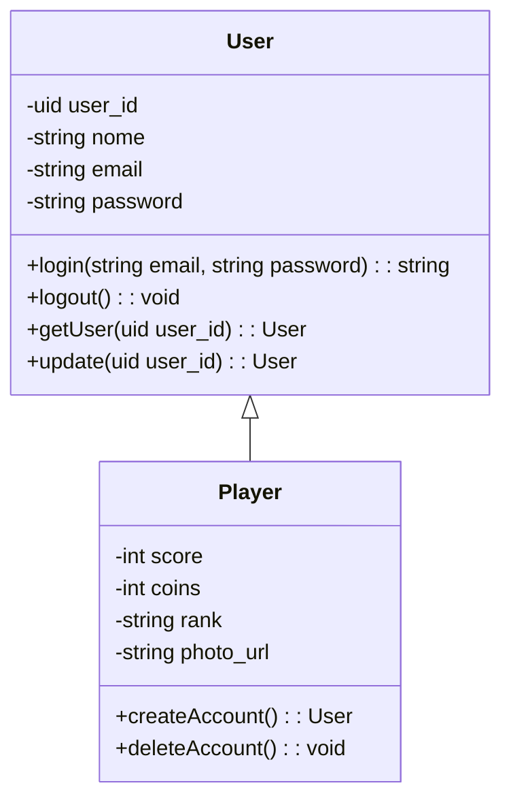

# ClassDG Compiler
> This repository contains the lexer and parser to a domain specific language called ClassDG to simplify the definition of class diagrams and for graphical representation using mermaid language. 

## Installation and Running:

### Step 1: Prerequisites

Make sure you have Python installed on your system. You can download Python from the official website: [Python Downloads](https://www.python.org/downloads/).

### Step 2: Creating a Virtual Environment

Open your terminal or command prompt and navigate to the directory where you want to create your project.

```bash
# Navigate to the directory where you want to create your project
cd path/to/your/directory

# Create a virtual environment named 'env'
python -m venv env

# Activate the virtual environment
.\env\Scripts\activate

# Now inside the enviroment install the library ply
pip install ply
```

### Step 3: Running

```bash
# To run you need to pass the python file and your input file as a argument
python ClassDG_to_Mermaid.py input.cdg
```

## Results

ClassDG Language:

```classDG
class User {
      - user_id : uid
      - nome : string
      - email : string
      - password : string
      + login(email: string, password: string): string
      + logout(): void
      + getUser(user_id: uid): User
      + update(user_id: uid): User
    }

class Player {
      - score : int
      - coins : int
      - rank : string
      - photo_url : string
      + createAccount(): User
      + deleteAccount(): void
    }

User <<- Player
```

Mermaid Result:

